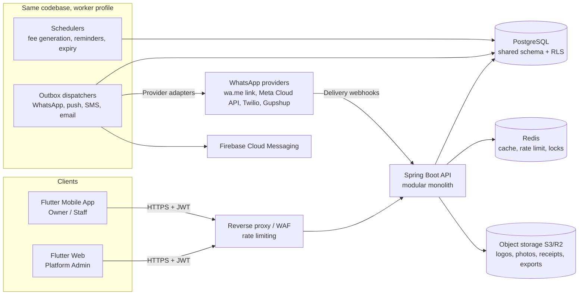
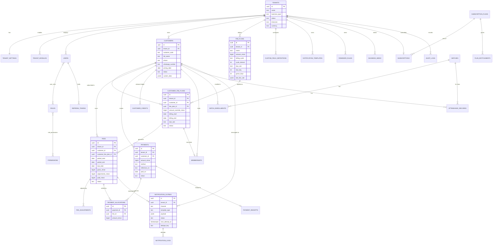
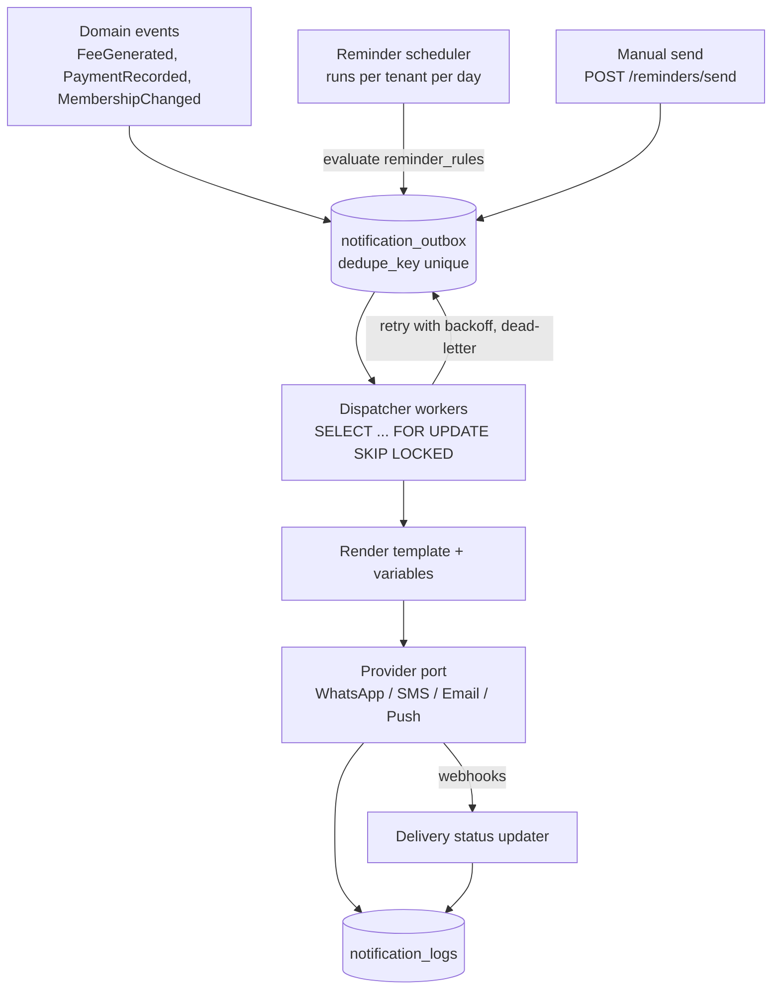

# Multi-Tenant Fee & Customer Management SaaS: Architecture v1

Status: **approved for Phase 1**. Build tool is **Gradle** (not Maven). Section 17 records locked decisions.

---

## 1. Product architecture

**One product, three surfaces, one backend.**

| Surface | Users | Tech | Purpose |
|---|---|---|---|
| **Owner/Staff mobile app** | Business owner, staff | Flutter (Android + iOS) | Daily work: pending fees, pay, remind, attendance |
| **Platform Admin console** | Your team | Flutter Web (shares packages with mobile) | Create tenants, presets, plans, flags, stats |
| **Backend API** | Both apps | Spring Boot modular monolith | All business logic, tenancy, jobs |

**Guiding principles**

1. **Configuration over code.** Business type is a *preset* (data), not an `if (gym)` branch. A preset bundles modules, terminology, custom fields, fee plans, templates, reminder rules and dashboard widgets. Creating a tenant = pick a preset, then override.
2. **Server-driven configuration.** After login the app calls `GET /me/bootstrap` and receives the tenant's modules, permissions, labels, custom-field definitions and dashboard layout. The Flutter app renders from this. Nothing business-specific is compiled in.
3. **Pending fees is the home screen.** Every design choice protects the "who owes me money?" answer.
4. **Modular monolith first.** One deployable, strict module boundaries, so any module can later be extracted (WhatsApp/notifications first).
5. **Money is an integer.** All amounts are stored as minor units (paise) in `BIGINT` with a currency code. No floats or doubles anywhere.

### Terminology layer
A gym has "Members", an academy has "Students", a tuition centre has "Students" and "Batches", others have "Customers". Each tenant has a `labels` map (`customer.singular`, `customer.plural`, `batch.singular`, and so on) that comes from the preset and can be edited. The UI never hard-codes the word "Customer".

---

## 2. High-level system architecture



**Runtime profiles.** The same Docker image starts as `api` (HTTP only), `worker` (schedulers and dispatchers only), or `all` (local dev). Scale them independently.

**Infrastructure (initial):** PostgreSQL 16, Redis, S3-compatible storage, Docker, and a single cloud region close to your users (Mumbai for India).

---

## 3. Flutter architecture

**Stack:** Flutter 3.x, Dart 3, **Riverpod** (with `riverpod_generator`), **GoRouter**, **Dio** (with interceptors), **Freezed + json_serializable**, `flutter_secure_storage`, `drift` (SQLite) *later* for offline read cache.

I recommend Riverpod over Bloc here. The app is mostly async server state (lists, filters, pagination), which Riverpod's `AsyncNotifier` handles with far less boilerplate. Dependency injection comes for free, which matters for swapping repositories in tests.

**Clean Architecture per feature:**

```
presentation/   screens, widgets, controllers (Riverpod notifiers)
domain/         entities, repository interfaces, use cases (pure Dart)
data/           DTOs (freezed), remote data sources (Dio), repository impls, mappers
```

Dependency rule: `presentation → domain ← data`. The domain layer imports no Flutter and no Dio.

**Cross-cutting (`core/`)**
- `network/`: Dio client, auth interceptor (attach token, single-flight refresh on 401, retry once), error mapper (`ApiException` → typed `Failure`), request-ID header.
- `auth/`: session controller, secure token store, router redirect guard.
- `config/`: `TenantConfig` (modules, labels, permissions, custom-field definitions), loaded from bootstrap and exposed as a provider.
- `ui/`: design system (tokens, buttons, status chips, empty states, skeletons), responsive helpers.
- `forms/`: **dynamic form engine**. It renders a form from `CustomFieldDefinition[]` (text, number, date, dropdown, multi-select, boolean, phone, and so on) and validates it. Used in customer forms, filters and the CSV import mapper.
- `feature_gate/`: `ModuleGate(module: attendance, child: ...)` and `PermissionGate(perm: payments.record, child: ...)` widgets. The nav bar, dashboard and actions are all built through these.

**Navigation:** GoRouter with a `StatefulShellRoute` bottom-nav (Home, Pending, Customers, Reports, More). Tabs are filtered by enabled modules and permissions. Route redirects handle unauthenticated, onboarding-incomplete and tenant-suspended states.

**Repository layout choice:** monorepo with `melos`:
```
apps/mobile         (owner/staff app)
apps/admin_web      (platform admin)
packages/core       (network, auth, design system, dynamic forms)
packages/api_client (DTOs + endpoints, later generated from OpenAPI)
```
The backend publishes an OpenAPI spec, and `api_client` can be generated from it, which keeps the contract in sync.

**Testing:** unit tests for use cases and mappers, widget tests for the pending-fees list, payment sheet and dynamic form, and golden tests for the design system.

---

## 4. Spring Boot architecture

**Stack:** Java 21, Spring Boot 3.x, Spring Web, Spring Security (resource server, JWT), Spring Data JPA + **jOOQ or `JdbcClient` for reporting queries**, **Flyway**, Bean Validation, MapStruct, Testcontainers, springdoc-openapi, Micrometer + OpenTelemetry, **ShedLock** for scheduler leader election.

**Modular monolith.** Each module has `api` (controllers and DTOs), `application` (services and use cases), `domain` (entities and rules), `infra` (repositories, adapters), plus an `events` package for domain events. Modules talk to each other **only through application interfaces or published events**, never through another module's repositories. Enforce this with **ArchUnit** tests in CI (and optionally Spring Modulith).

Modules: `auth`, `tenant`, `user`, `configuration` (presets, custom fields, labels, flags), `customer`, `fee`, `payment`, `membership`, `attendance`, `batch`, `notification` (templates, rules, outbox, logs), `whatsapp` (provider ports and adapters), `report`, `subscription` (SaaS plans and entitlements), `audit`, `media`, `imports`, `shared` (money, time, tenancy context, errors).

**Layering rules:** controllers only map DTOs and delegate. Services hold use-case logic and transaction boundaries. Domain objects hold invariants (for example, a `Fee` cannot be over-allocated). Repositories are interfaces in the domain and implemented in `infra`.

**Cross-cutting**
- `TenantContext` (request-scoped, populated from the JWT by a filter), read by services and by the RLS connection hook.
- Global `@RestControllerAdvice` returning RFC 7807 `application/problem+json`.
- Pagination: keyset (cursor) pagination for large lists (fees, payments, logs), offset only for small admin lists.
- Idempotency: `Idempotency-Key` header on payment creation and bulk actions.
- Async: domain events go through a **transactional outbox**. No "send WhatsApp inside the payment transaction".

---

## 5. PostgreSQL design

### 5.1 Conventions
- PK: `UUID` (v7 preferred for index locality). Human-facing IDs (customer code, receipt number) are separate columns.
- Every tenant-owned table has `tenant_id UUID NOT NULL`, `created_at`, `updated_at`, `created_by`, `version` (optimistic lock), and soft delete (`deleted_at`) where history matters.
- Money: `BIGINT` minor units. Dates for billing: `DATE` interpreted in the tenant's timezone. Instants: `TIMESTAMPTZ`.
- Enums: `TEXT` + `CHECK` constraint (easier to migrate than native PG enums).

### 5.2 Tenant isolation at the database level
Each tenant-owned table gets a **composite unique key `(tenant_id, id)`**, and children reference it with **composite foreign keys**:

```sql
ALTER TABLE customers ADD CONSTRAINT uq_customers_tenant_id UNIQUE (tenant_id, id);

CREATE TABLE fees (
  ...
  tenant_id   UUID NOT NULL,
  customer_id UUID NOT NULL,
  FOREIGN KEY (tenant_id, customer_id) REFERENCES customers (tenant_id, id)
);
```
This makes it **physically impossible** for a fee in tenant A to point at a customer in tenant B, even if application code has a bug.

### 5.3 Table catalogue (grouped)

**Identity & platform**
`tenants`, `tenant_settings` (1:1: currency, timezone, working hours, contacts, socials, labels JSONB), `tenant_modules`, `users`, `roles`, `permissions`, `role_permissions`, `user_roles`, `refresh_tokens`, `feature_flags`, `tenant_feature_flags`, `business_type_presets` (JSONB bundles), `subscription_plans`, `plan_entitlements`, `subscriptions`, `usage_counters`.

**Business config**
`custom_field_definitions`, `business_media`, `fee_types` (optional grouping such as Tuition/Registration/Uniform), `notification_templates`, `reminder_rules`.

**Core domain**
`customers`, `fee_plans`, `customer_fee_plans` (a customer's subscription to a plan), `fees` (the invoice-like due items), `fee_adjustments` (discount, late fee, waiver), `payments`, `payment_allocations`, `payment_receipts`, `customer_credits` (advance-payment ledger), `memberships`, `batches`, `batch_enrollments`, `attendance_records`, `qr_tokens`.

**Communication & ops**
`notification_outbox`, `notification_logs`, `push_devices`, `import_jobs`, `import_rows`, `audit_logs`, `tenant_counters` (per-tenant sequences for customer codes and receipt numbers), `scheduler_runs`.

### 5.4 Custom fields: a deliberate deviation from your table list
You listed `custom_fields` and `custom_field_values`. I recommend **definitions in a table, values in a `custom_data JSONB` column on `customers`**:

- Fast reads: one row, no joins for a profile or list.
- Filtering and search: GIN index (`jsonb_path_ops`), plus expression indexes for hot fields.
- Validation is done against the definitions in the service layer (type, required, options, min/max).
- The classic EAV `custom_field_values` table makes every list query a pivot and gets slow at scale.

`custom_field_definitions`: `tenant_id, entity_type (CUSTOMER|BATCH|...), key, label, type, options JSONB, required, searchable, filterable, show_in_list, sort_order, active`. Deleting a field is a soft deactivation (`active=false`) so old data isn't orphaned. If you want the strict separate `custom_field_values` table anyway, it's an easy swap, but I'd advise against it.

### 5.5 ER diagram (core)



### 5.6 Key constraints and indexes

| Table | Constraint / index | Reason |
|---|---|---|
| `fees` | `UNIQUE (customer_fee_plan_id, period_start)` | **Prevents duplicate fee generation** (engine is idempotent) |
| `fees` | `CHECK (paid_minor >= 0 AND paid_minor <= gross_minor + adjustments_minor)` | Never over-allocated |
| `fees` | index `(tenant_id, due_date) WHERE status IN ('PENDING','PARTIALLY_PAID','OVERDUE')` | Pending Fees screen (partial index stays small) |
| `fees` | index `(tenant_id, customer_id, period_start DESC)` | Customer profile |
| `customers` | `UNIQUE (tenant_id, customer_code)`; `UNIQUE (tenant_id, phone) WHERE deleted_at IS NULL` (configurable duplicates policy) | ID and duplicate detection |
| `customers` | GIN `pg_trgm` on `full_name`; btree on `phone` (normalized E.164); GIN on `custom_data` | Fast search |
| `payments` | `UNIQUE (tenant_id, idempotency_key)` | Safe retries |
| `payment_receipts` | `UNIQUE (tenant_id, receipt_no)` | Sequential receipts |
| `payment_allocations` | `UNIQUE (payment_id, fee_id)` | One line per fee per payment |
| `notification_outbox` | `UNIQUE (tenant_id, dedupe_key)`; index `(status, next_attempt_at)` | No double reminders; dispatcher polling |
| `attendance_records` | `UNIQUE (tenant_id, customer_id, batch_id, attendance_date)` | One record per day per class |
| `audit_logs` | index `(tenant_id, entity_type, entity_id, created_at DESC)`; partition by month | Big append-only table |
| `users` | `UNIQUE (lower(email))`, `UNIQUE (phone)` (global) | Login lookup without tenant hint |
| all tenant tables | leading column `tenant_id` in composite indexes | Tenant-scoped scans |

### 5.7 Fee status model
- **Stored:** `PENDING`, `PARTIALLY_PAID`, `PAID`, `CANCELLED`.
- **Effective status (computed at read time):** `OVERDUE` = stored status in (`PENDING`, `PARTIALLY_PAID`) AND `today(tenant tz) > due_date + grace_days`.

Storing `OVERDUE` only from a nightly job risks staleness (a job failing or lagging shows wrong data). So overdue is a **query predicate/expression**, and a nightly job *also* materializes it for indexing and notifications. The API always returns `effective_status`, so the client never has to compute it.

### 5.8 Payments are immutable
A recorded payment is never edited or deleted in place. Corrections are **void + re-record** (with a reason), and the audit log links both. This keeps receipts, reports and cash reconciliation trustworthy. Your spec mentions "Payment edited/deleted" in the audit log. Those will be implemented as void/reversal events, and the UI can still present them as "Edit" and "Delete".

---

## 6. Multi-tenancy strategy

**Model: shared database, shared schema, `tenant_id` on every row, enforced in three layers.** This is the right choice for thousands of small tenants (cost and ops simplicity). Schema-per-tenant or DB-per-tenant becomes painful past a few hundred tenants because of migrations and connection counts.

| Layer | Mechanism |
|---|---|
| **1. Identity** | `tenant_id` is a claim in the signed JWT. **The client never sends `tenant_id`.** Only platform admins may target a tenant, via an explicit path parameter on `/platform/**` routes, which are separately authorized. |
| **2. Application** | A `TenantContext` filter reads the claim. Hibernate `@Filter` (or a base repository specification) appends `tenant_id = :current` to every query. Base entity `@PrePersist` stamps `tenant_id` from the context, ignoring any DTO value. Lookup by ID always goes through `findByTenantIdAndId`. |
| **3. Database** | **PostgreSQL Row-Level Security.** Each request transaction runs `SET LOCAL app.tenant_id = '<uuid>'`, and every tenant table has `POLICY tenant_isolation USING (tenant_id = current_setting('app.tenant_id')::uuid)`. The app connects as a **non-owner role without `BYPASSRLS`**. Migrations and platform jobs use a separate privileged role. |
| **4. Schema** | Composite foreign keys (section 5.2) so cross-tenant references cannot exist. |

**Background jobs** run per tenant: the scheduler loads the tenant list, then processes each in its own transaction with `SET LOCAL app.tenant_id` set. A bug in one tenant's job cannot touch another's data, and one failing tenant doesn't block the rest.

**Testing tenant isolation is a first-class CI test:** an integration suite creates tenants A and B, then attempts every read/write endpoint with A's token against B's IDs and asserts 404. It also directly queries the DB under A's RLS context and asserts B's rows are invisible.

**Noisy neighbour controls:** per-tenant rate limits (Redis), per-tenant caps from plan entitlements, and statement timeouts. Large tenants can later be moved to a dedicated database (the `tenants.db_shard` column reserves this).

---

## 7. Authentication & authorization

### Login
- **Owner/staff:** email or phone + password (Argon2id). **Recommend adding phone OTP login as a fast follow.** It suits non-technical Indian business owners much better than passwords, and the auth module is designed for multiple credential types.
- **Platform admin:** email + password + mandatory TOTP 2FA.

### Token flow
```mermaid
sequenceDiagram
  participant App
  participant API
  participant DB
  App->>API: POST /auth/login (credentials, device_id)
  API->>DB: verify user, tenant status, plan
  API-->>App: access JWT (15 min) + refresh token (30 days, opaque)
  Note over API,DB: refresh token stored HASHED, bound to device
  App->>API: request + Bearer access JWT
  API->>API: verify signature, exp, token_version; set TenantContext
  App->>API: POST /auth/refresh (refresh token)
  API->>DB: rotate token; detect reuse
  API-->>App: new access + new refresh
  Note over API: reuse of an old refresh token revokes the whole token family
```

- **Access JWT** (RS256/ES256, key rotation via `kid`): `sub`, `tenant_id`, `roles`, `ver` (user token version), `exp`. Permissions are **not** stuffed into the token. They are resolved server-side (cached in Redis for a few minutes) so permission changes apply quickly.
- **Refresh tokens:** opaque, hashed at rest, rotated on every use, family-based reuse detection, revoked on password change, logout, or user/tenant suspension. Stored in `flutter_secure_storage` (Keychain/Keystore).
- **Suspended tenant:** a tenant-status check in the filter returns `403 TENANT_SUSPENDED`. The app shows a dedicated screen.

### Authorization
- **RBAC with permission strings:** `customers.view|create|edit|delete`, `payments.record|void`, `fees.manage`, `reminders.send`, `reports.view`, `attendance.manage`, `settings.manage`, `staff.manage`, and so on.
- System roles: `PLATFORM_SUPER_ADMIN`, `BUSINESS_OWNER`, and `STAFF` (with per-user permission sets, which is why the design is permission-based rather than role-checked).
- Enforced with `@PreAuthorize("hasPermission(...)")` on services, **plus module checks** (`@RequiresModule("ATTENDANCE")`) and plan-entitlement checks. The Flutter gates are UX only and never the security boundary.
- **Support impersonation:** platform admins can enter a tenant in "support mode", which issues a short-lived, clearly flagged token and writes an audit entry.

---

## 8. API specification (v1)

Base: `/api/v1`. JSON. Cursor pagination `?cursor=&limit=`. Errors follow RFC 7807. `Idempotency-Key` header supported on POSTs that create money records or messages.

### Auth & session
| Method | Path | Notes |
|---|---|---|
| POST | `/auth/login` | Returns access and refresh tokens |
| POST | `/auth/refresh` | Rotating refresh |
| POST | `/auth/logout` | Revokes the token family |
| POST | `/auth/password/forgot`, `/reset`, `/change` | |
| POST | `/auth/otp/request`, `/verify` | Phase 1.5 |
| GET | `/me/bootstrap` | User, permissions, tenant config, modules, labels, custom fields, dashboard layout, entitlements |

### Platform admin (`/platform/**`, super admin only)
| Method | Path |
|---|---|
| GET/POST | `/platform/tenants` |
| GET/PATCH | `/platform/tenants/{id}` |
| POST | `/platform/tenants/{id}/suspend`, `/activate`, `/impersonate` |
| PUT | `/platform/tenants/{id}/modules` |
| PUT | `/platform/tenants/{id}/feature-flags` |
| PUT | `/platform/tenants/{id}/subscription` |
| GET | `/platform/tenants/{id}/stats`, `/platform/stats` |
| CRUD | `/platform/presets` (business-type presets) |
| CRUD | `/platform/plans`, `/platform/feature-flags` |
| CRUD | `/platform/users` |

### Tenant configuration
| Method | Path |
|---|---|
| GET/PATCH | `/tenant/profile` (name, contacts, hours, socials, currency, timezone, labels) |
| GET/PUT | `/tenant/modules` (read-only for owners unless allowed by plan) |
| CRUD | `/custom-fields` (`?entity=CUSTOMER`) |
| POST | `/media` (upload), PATCH `/media/reorder`, DELETE `/media/{id}` |
| GET/POST/PATCH | `/onboarding` (wizard state and completion) |

### Users & staff
`GET/POST /staff`, `GET/PATCH/DELETE /staff/{id}`, `PUT /staff/{id}/permissions`, `GET /roles`.

### Customers
| Method | Path |
|---|---|
| GET | `/customers?q=&status=&batch=&plan=&cf.<key>=&sort=&cursor=` |
| POST | `/customers` |
| GET/PATCH/DELETE | `/customers/{id}` |
| GET | `/customers/{id}/profile` (summary: membership, plan, outstanding, attendance %) |
| GET | `/customers/{id}/fees`, `/payments`, `/attendance`, `/communications`, `/memberships` |
| POST | `/customers/{id}/fee-plans` (assign plan) |
| POST | `/imports` (upload), GET `/imports/{id}` (validation report), PATCH `/imports/{id}/rows/{n}` (correct), POST `/imports/{id}/commit` |
| GET | `/search?q=` (global) |

### Fees
| Method | Path |
|---|---|
| CRUD | `/fee-plans` |
| PATCH/DELETE | `/customer-fee-plans/{id}` (change price, pause, end) |
| GET | `/fees?status=&from=&to=&customerId=&planId=&minAmount=&maxAmount=&bucket=today\|week\|month\|overdue` |
| GET | `/fees/pending/summary` (totals per bucket, powers dashboard and filter chips) |
| POST | `/fees` (one-off fee) |
| POST | `/fees/{id}/adjustments` (discount, late fee, waiver) |
| POST | `/fees/{id}/cancel` |

### Payments
| Method | Path |
|---|---|
| POST | `/payments` (body: customer, amount, method, ref, date, and `allocations[]` or `autoAllocate: true`) |
| GET | `/payments`, `/payments/{id}` |
| POST | `/payments/{id}/void` (with reason) |
| GET | `/payments/{id}/receipt` (PDF), POST `/payments/{id}/receipt/share` (queues WhatsApp) |

### Membership, batches, attendance
`/memberships` (CRUD + `/{id}/renew`, `/freeze`, `/unfreeze`, `/cancel`, `GET ?status=EXPIRING_SOON`), `/batches` (CRUD, `/{id}/enrollments`), `POST /attendance` (bulk mark), `GET /attendance?date=&batchId=`, `POST /attendance/qr-scan`, `GET /qr/customers/{id}` (member QR), `GET /qr/session` (rotating class QR).

### Notifications & WhatsApp
| Method | Path |
|---|---|
| CRUD | `/templates` (`type=FEE_DUE\|FEE_OVERDUE\|PAYMENT_RECEIVED\|MEMBERSHIP_EXPIRY\|WELCOME\|BIRTHDAY\|ANNOUNCEMENT`) |
| POST | `/templates/{id}/preview` (renders with sample data; also returns the variable list) |
| CRUD | `/reminder-rules` |
| POST | `/reminders/send` (body: `feeIds[]`, `templateId`, `channel`) → returns per-recipient results |
| POST | `/announcements` |
| GET | `/communications?customerId=&feeId=&status=` |
| GET/PUT | `/integrations/whatsapp` (provider and credentials, encrypted) |
| POST | `/webhooks/whatsapp/{provider}` (public, signature-verified) |
| POST | `/devices/push` (register FCM token) |

### Dashboard, reports, audit
`GET /dashboard` (widgets filtered by enabled modules), `GET /reports/{daily-collection|monthly-collection|outstanding|overdue|customer-payments|revenue-by-plan|attendance|membership-expiry|new-customers}?format=json|csv|xlsx|pdf` (large exports are async: `POST /exports` → poll → download URL), `GET /audit-logs?entity=&userId=&from=&to=`.

### Subscription (tenant side)
`GET /subscription` (plan, usage vs limits), later `POST /subscription/upgrade`.

---

## 9. WhatsApp integration design

### The important reality check
Two very different ways to send WhatsApp messages exist, with different trade-offs:

| | **A. Click-to-chat (`wa.me` deep link)** | **B. WhatsApp Business API (Meta Cloud API or a BSP such as Twilio/Gupshup/Interakt)** |
|---|---|---|
| Who sends | The owner's own WhatsApp app | Your system, from a verified business number |
| Cost / setup | Free, zero setup | Per-conversation fees, business verification, number registration |
| Automation | **No.** A human taps Send for each message | Fully automated, bulk, scheduled |
| Template rules | None | Business-initiated messages **must use pre-approved templates** |
| Delivery status | Unknown | Sent/delivered/read/failed via webhook |

So **"Send Reminder to 25 selected customers"** works one-tap-each with option A, and truly in bulk only with option B. **Automated reminder rules require option B.**

**Recommendation:** ship option A in the MVP (the owner's workflow works on day one, with no approvals), and build option B behind the same abstraction in Phase 6 so it is a per-tenant switch.

### Provider abstraction
```java
public interface MessagingChannel {            // port, lives in notification module
    ChannelType type();                        // WHATSAPP, SMS, EMAIL, PUSH
    ProviderCapabilities capabilities();       // supportsBulk, supportsDeliveryReceipts, requiresApprovedTemplates
    SendResult send(OutboundMessage message);  // never throws for provider errors; returns typed result
    Optional<DeliveryUpdate> parseWebhook(HttpRequestData req);
}
```
Adapters (in `whatsapp` module): `ClickToChatAdapter` (returns a prepared `wa.me` URL for the client to open, status `PENDING_MANUAL`), `MetaCloudApiAdapter`, `TwilioAdapter`, `GupshupAdapter`. A `ProviderRegistry` resolves the adapter from `tenant_integrations`. Credentials are envelope-encrypted per tenant. **Flutter never knows which provider is in use.** It calls `POST /reminders/send` and receives per-message results (`QUEUED`, `MANUAL_ACTION_REQUIRED` with a `waLink`, `FAILED`), then opens links sequentially for manual ones.

### Templates and variables
- Template body stored as text with `{{variable}}` placeholders. A **variable registry** (code) defines allowed variables per template type, their sources and formatters (`amount` → `₹1,500`, `due_date` → tenant-locale date). Unknown variables are rejected at save time; the preview endpoint renders real sample data.
- **API providers need approved templates with numbered params (`{{1}}`).** Each `notification_template` therefore has an optional `provider_template_map` (`provider`, `provider_template_name`, `language`, `param_order: [customer_name, fee_type, amount, ...]`). The renderer produces both the plain text (for click-to-chat and history) and the ordered parameter list (for API sends). Editing an approved template's body resets its approval state.
- **24-hour session window:** free-form messages are only allowed within 24 h of the customer's last message. Reminders are always template messages.
- Opt-in/opt-out: `customers.whatsapp_opt_in` and a per-customer "do not message" flag are checked before sending.

### Delivery tracking
Provider webhook → `POST /webhooks/whatsapp/{provider}` (signature verified) → matched to `notification_logs` by provider message ID → status `SENT → DELIVERED → READ` or `FAILED (reason)`. Communication history reads from `notification_logs`.

---

## 10. Recurring fee engine

### Concepts
- **`fee_plans`:** amount, `billing_cycle` (WEEKLY / MONTHLY / QUARTERLY / HALF_YEARLY / ANNUAL / CUSTOM with `cycle_interval` + unit), default `due_rule`, grace days, late-fee rule.
- **`customer_fee_plans`:** a customer's subscription: `billing_start`, optional `amount_override`, discount, optional `billing_end`, `due_rule`, and status (`ACTIVE`, `PAUSED`, `ENDED`).
- **`fees`:** one row per billing period per subscription.

### Due-date rules (`due_rule`)
| Rule | Behaviour |
|---|---|
| `ON_JOINING_DATE` (anniversary) | Period N starts at `billing_start + N × cycle`; due date = period start. Day 29-31 clamps to the last day of shorter months. |
| `FIXED_DAY_OF_MONTH` (e.g., 1st) | Periods align to the calendar. **First period is either prorated, free, or charged in full, selectable per plan** (`first_period_policy`). |
| `CUSTOM` | Due date = period start + N days, or a specific day. |

Your example (join 10 Jan, ₹1,000/month, due on the 1st): the Jan period is covered by the first-period policy, then Feb, Mar and Apr fees are due on the 1st.

### Generation mechanism
1. **Scheduler** (worker profile, ShedLock leader lock) runs hourly. For each tenant whose local time is past ~01:00, it runs `GenerateFeesUseCase` once per day.
2. For each `ACTIVE` `customer_fee_plan` where `next_fee_period_start <= today + lead_days` (default lead = 0..7 days, configurable), it computes the next period(s) and inserts `fees`.
3. **Idempotency:** `INSERT ... ON CONFLICT (customer_fee_plan_id, period_start) DO NOTHING`. Re-running, crashing mid-batch, or two workers colliding cannot create duplicates. The generator advances a `generated_through` cursor in the same transaction.
4. **Catch-up:** if the job missed days, the loop generates every missed period up to the horizon, one row per period.
5. **Events:** each new fee publishes `FeeGenerated` (feeds the reminder scheduler and push summaries).
6. **Price changes** apply only to *future* ungenerated periods. Existing fees are edited only via explicit adjustments.
7. **Backfill safety on import:** the import wizard asks "Bill from which date?" (default: current period). Otherwise importing a customer who joined two years ago would create 24 overdue fees, which would be an unpleasant surprise.
8. **On-demand generation** also runs immediately when a plan is assigned, so the owner sees the fee at once without waiting for the nightly job.

### Payment allocation
- `POST /payments` with `autoAllocate` settles the customer's **oldest unpaid fee first** (FIFO). Users can override allocations manually.
- Partial payment: `paid_minor` increases, status → `PARTIALLY_PAID`. Full → `PAID`.
- **Advance payments/overpayment:** the surplus goes to `customer_credits` (a ledger of credits and debits). Newly generated fees consume available credit automatically.
- Discounts, late fees and waivers are `fee_adjustments` rows (signed amounts, with reason and author), and `fees.adjustments_minor` is a denormalized total maintained in the same transaction.
- **Late fees:** applied by a daily job as a `fee_adjustment` of type `LATE_FEE` once (or per period, depending on the rule) after the grace period. A unique key prevents double-charging.
- Concurrency: payment recording locks the target `fees` rows (`SELECT ... FOR UPDATE`) and validates against optimistic `version`.

### Membership relationship
Membership is the *entitlement period*, fees are the *money*. The plan has `membership_mode`: `INDEPENDENT` (manual dates), or `TIED_TO_PAYMENT` (paying a fee extends `memberships.end_date` by one cycle). This covers both gym-style and coaching-style businesses without code branches. `EXPIRING_SOON` = end date within the tenant's configured window.

---

## 11. Notification & reminder architecture



- **Reminder rules** (`reminder_rules`): `tenant_id, name, trigger (BEFORE_DUE | ON_DUE | AFTER_DUE | BEFORE_MEMBERSHIP_EXPIRY | ...), offset_days, template_id, channel, active`. Your four examples (−3, 0, +3, +7) are four seeded rows that owners can toggle or edit.
- **Scheduler:** daily per tenant (in tenant tz, at a configurable send hour, default ~10:00). Finds unpaid fees matching each rule's offset and enqueues outbox rows with `dedupe_key = tenant:fee:rule:date`. Because of the unique key, reruns are harmless. A fee that gets paid before its reminder time is skipped at dispatch time (**re-check status at send**).
- **Outbox pattern:** enqueue in the same DB transaction as the triggering change, so nothing is lost or sent for a rolled-back change. Dispatchers poll with `FOR UPDATE SKIP LOCKED`, which gives safe horizontal scaling with no separate broker in the MVP. If volume demands it, the outbox can later publish to SQS/RabbitMQ without changing producers.
- **Retries:** exponential backoff, max attempts, then `FAILED` with a reason. Provider rate limits are respected with per-provider token buckets.
- **Quiet hours** (no sending at night) and **per-tenant daily caps** (from plan entitlements) are enforced in the dispatcher.
- **Push notifications (FCM):** owner-facing digests, generated by scheduled summary jobs ("25 customers have pending fees", "₹45,000 pending this month", "5 memberships expire this week") and event pushes ("Payment received from Rahul"). Devices are stored in `push_devices`, and invalid tokens are pruned on FCM errors. Deep links open the relevant screen.
- **Communication history** = `notification_logs` joined to customer and fee, so the profile shows: *September Fee → Reminder → WhatsApp → 28 Sep 2026 → Delivered*.

---

## 12. Subscription / SaaS billing (design only)

- `subscription_plans` (FREE / BASIC / PRO / BUSINESS, price, billing period) and `plan_entitlements` (`key`, `limit`): `max_customers`, `max_staff`, `max_whatsapp_messages_per_month`, `storage_mb`, `modules[]`, `reports_enabled`, `exports_enabled`.
- `subscriptions`: tenant, plan, status (`TRIAL`, `ACTIVE`, `PAST_DUE`, `CANCELLED`), period start/end, `provider`, `provider_ref` (null for now, since you'll invoice manually or add Razorpay/Stripe later).
- `usage_counters`: per tenant per period, incremented atomically (Redis + periodic flush).
- **Entitlement enforcement point:** a single `EntitlementService.check(tenant, key, delta)` called from services (for example, `CustomerService.create` → `max_customers`). Feature flags can override plan limits per tenant for special deals.
- Effective modules = preset/tenant module toggles ∩ plan-allowed modules.

---

## 13. Project structure

### Monorepo
```
feesaas/
├─ backend/                 (Spring Boot)
├─ apps/
│  ├─ mobile/               (Flutter)
│  └─ admin_web/            (Flutter Web)
├─ packages/
│  ├─ core/
│  └─ api_client/
├─ infra/                   (docker-compose, Dockerfiles, CI, IaC later)
├─ docs/                    (this document, ADRs, runbooks)
└─ melos.yaml
```

### Backend
```
backend/src/main/java/com/feesaas/
├─ FeeSaasApplication.java
├─ shared/
│  ├─ tenancy/      TenantContext, TenantFilter, RlsConnectionCustomizer, TenantEntity
│  ├─ money/        Money, Currency
│  ├─ time/         TenantClock
│  ├─ error/        ProblemDetails, ApiException, GlobalExceptionHandler
│  ├─ security/     JwtService, PermissionEvaluator, RateLimitFilter
│  └─ persistence/  BaseEntity, AuditingConfig, Outbox support
├─ auth/            api/ application/ domain/ infra/
├─ tenant/          ...
├─ user/
├─ configuration/   presets, custom fields, labels, feature flags
├─ customer/
├─ fee/             plans, subscriptions, engine/, allocation/
├─ payment/
├─ membership/
├─ attendance/      (+ batch/)
├─ notification/    templates, rules, outbox, dispatcher, logs
├─ whatsapp/        adapters/, webhook/
├─ report/
├─ subscription/
├─ audit/
├─ media/
└─ imports/
backend/src/main/resources/
├─ db/migration/    V001__init.sql ...   (Flyway)
└─ application-{local,test,prod}.yml
backend/src/test/   unit/, integration/ (Testcontainers), architecture/ (ArchUnit), tenancy/ (isolation suite)
```

### Flutter app
```
apps/mobile/lib/
├─ main.dart, app.dart
├─ router/           app_router.dart, guards.dart
└─ features/
   ├─ auth/          {presentation,domain,data}
   ├─ onboarding/
   ├─ dashboard/
   ├─ pending_fees/
   ├─ customers/
   ├─ fee_plans/
   ├─ payments/
   ├─ reminders/     (templates, rules, history)
   ├─ membership/
   ├─ attendance/
   ├─ batches/
   ├─ reports/
   ├─ business_profile/  (branding, gallery)
   ├─ staff/
   ├─ imports/
   └─ settings/
```

---

## 14. MVP feature list

**Must have (MVP: sellable to first 10 businesses)**
1. Auth (email/phone + password), staff invites, RBAC (owner and staff with permissions)
2. Platform admin console: create tenant from preset, modules, suspend/activate
3. Business profile and branding (logo, contacts, currency/timezone)
4. Customers: CRUD, search, filters, custom fields, profile
5. Fee plans, assign plan, **recurring fee engine**, due dates, grace period
6. **Dashboard and Pending Fees screen** (filters, bulk select)
7. Record payment (cash/UPI/etc.), partial payment, receipt PDF, share receipt
8. **WhatsApp reminders via click-to-chat** (templates with variables, communication history)
9. CSV import with validation
10. Basic reports (collection, outstanding) with CSV export
11. Audit log, push notifications (pending summary)

**Should have (v1.1):** membership expiry and freeze, reminder automation via WhatsApp Business API, attendance (manual), batches, PDF/Excel exports, phone OTP login.

**Later:** QR attendance, subscription billing UI, advanced reports, expenses, inventory, exams, online payments, multi-branch, customer portal.

---

## 15. Phase 1 implementation plan (Foundation, ~2-3 weeks)

**Backend**
1. Repo scaffold: Gradle (Kotlin DSL + wrapper), Java 21, Spring Boot, Flyway, Testcontainers, ArchUnit, springdoc, Docker Compose (Postgres 16 + Redis).
2. Migrations V001-V003: `tenants`, `tenant_settings`, `tenant_modules`, `users`, `roles`, `permissions`, `role_permissions`, `user_roles`, `refresh_tokens`, `audit_logs`, `tenant_counters`; composite-key and RLS policy templates; two DB roles (migration/owner and app).
3. `shared`: `TenantContext`, `TenantFilter`, RLS connection hook, base entity, `Money`, error handling.
4. `auth`: login, refresh rotation with reuse detection, logout, password change/reset (stubbed email), Argon2id.
5. `tenant` + `user`: minimal platform endpoint to create a tenant with its owner, and staff CRUD with permission sets.
6. `audit` module (append-only writer via events).
7. `GET /me/bootstrap` with a first version of the config payload.
8. **Tenant isolation test suite** (the gate for finishing Phase 1).
9. CI: build, unit, integration, migration validation.

**Flutter**
1. Melos monorepo, `packages/core` (Dio client, auth interceptor with single-flight refresh, secure storage, error mapping).
2. Design system foundation (theme tokens, buttons, inputs, status chip, empty/error/loading states).
3. Auth feature (login, session restore, logout), GoRouter guards, tenant-suspended screen.
4. Bootstrap loading, `TenantConfig` provider, `ModuleGate`/`PermissionGate`, empty shell with dynamic bottom nav.
5. Staff list and add (permission picker).

**Definition of done:** an owner can log in on Android and iOS, tokens refresh transparently, the nav adapts to enabled modules, staff can be added with limited permissions, and the isolation suite proves A cannot see B.

---

## 16. Potential problems & recommended solutions

### Scalability
| Problem | Solution |
|---|---|
| Nightly generation and reminders across thousands of tenants at the same hour | Process per tenant in batches with a bounded worker pool; stagger by tenant timezone and hash offset; keyset iteration; make every job idempotent and resumable |
| Hot `fees`, `notification_logs`, `audit_logs` tables | Partial indexes for the open-fee set; **monthly partitioning** on logs and audit; archive old rows |
| Dashboard aggregates slow on large tenants | Indexed range queries first; then a per-tenant daily `tenant_daily_stats` rollup table updated by events/jobs; cache in Redis with short TTL |
| Global search | `pg_trgm` + normalized phone is enough for a very long time; move to OpenSearch only if needed |
| Large exports blocking API | Async export jobs writing to object storage, delivered via signed URL |
| Connection exhaustion with RLS `SET LOCAL` | Always set inside the transaction (never session-level), use PgBouncer in transaction mode |
| One giant tenant | Reserved `db_shard` routing; move to a dedicated DB |
| Scheduler double-run on multiple instances | ShedLock and idempotent writes (both) |

### Security
| Risk | Mitigation |
|---|---|
| **Cross-tenant data leak (IDOR)** | Four-layer isolation (section 6), isolation test suite in CI, never accept `tenant_id` from clients |
| Stolen refresh token | Rotation with reuse detection, device binding, hashed storage, revoke on password change |
| Credential stuffing / OTP abuse | Per-IP and per-account rate limits, lockout with backoff, OTP throttling, WAF |
| Privilege escalation via staff permissions | Server-side permission evaluation on every service call, permission-change audit, staff cannot grant permissions they lack |
| Stored WhatsApp/provider secrets | Envelope encryption (KMS), never returned by the API, masked in logs |
| Template injection / abusive messaging | Variable allow-list, no expression evaluation, per-tenant send caps, opt-out handling |
| Malicious CSV / uploads (CSV injection, oversized, wrong type) | Size limits, MIME sniffing, escape formula prefixes (`= + - @`) on export, virus scan optional, images re-encoded |
| Webhook spoofing | Signature verification, replay window, provider IP allow-listing where available |
| PII / data protection (India DPDP Act) | Encryption at rest and in transit, minimal PII in logs, data export and deletion tooling, consent and opt-in for messaging, retention policy |
| Payment tampering | Immutable payments, void-with-reason, audit trail, role-gated, receipts sequential |
| Tenant suspended but token still valid | Tenant status checked in the filter with a short cache |

### Product / operational
| Problem | Solution |
|---|---|
| WhatsApp is not simply "send" (approved templates, 24 h window, opt-in, costs) | Provider abstraction and capability flags; click-to-chat MVP; be explicit in the UI about manual vs automatic |
| Phone number quality (formats, missing country code) | Normalize to E.164 on input and import, default country from tenant |
| Fee edge cases (month-end, plan change mid-cycle, proration, pauses) | Explicit `due_rule` and `first_period_policy`, price changes only affect future periods, pause/resume creates no fees while paused |
| Timezones | Billing dates are tenant-local `DATE`; jobs evaluate "today" per tenant timezone |
| Import creating massive back-dated dues | "Bill from" date step and preview of fees to be created |
| Config sprawl, so onboarding takes more than 5 minutes | Presets provide everything; the wizard only asks for what differs |
| Preset drift (updating a preset shouldn't break tenants) | Presets are copied into tenant data at creation; versioned, with optional "apply new defaults" action |
| Offline use (spotty gym/academy Wi-Fi) | Read-through cache for lists in Phase 11; queue payments with idempotency keys |

---

## 17. Key design decisions (locked)

1. **Custom field values as JSONB on `customers`**, not a separate EAV `custom_field_values` table (section 5.4).
2. **Payments immutable**; "edit/delete" implemented as void + re-record (section 5.8).
3. **WhatsApp MVP = click-to-chat** (no automation, free). First Business API adapter in Phase 6 is **Gupshup** (India pricing and common BSP for this market); **Meta Cloud API** is the second adapter. Twilio/Interakt stay behind the same port. Override if you already have a BSP account.
4. **Platform Admin as a Flutter Web app** (separate from the mobile app) rather than a hidden section of the owner app.
5. **Login:** email/phone + password first; phone OTP in Phase 1.5.
6. **Overdue is computed, not just stored** (section 5.7).
7. **Fee engine:** both monthly-anniversary (`ON_JOINING_DATE`) and fixed-day (`FIXED_DAY_OF_MONTH`) ship in v1. Gym/fitness presets default to anniversary; academy/tuition presets default to fixed day. `first_period_policy` is configurable per plan.
8. **Single branch per tenant** for now; multi-branch reserved (nullable `branch_id` later).
9. **Stack:** Java 21 + Spring Boot 3 + **Gradle**, PostgreSQL 16, Redis, S3-compatible storage. Early-stage cloud: **DigitalOcean** in Bangalore/Mumbai-adjacent; stay cloud-agnostic so a later move to AWS `ap-south-1` is a deploy change, not a redesign.
10. **Currency:** INR is the default; schema is currency-agnostic.
